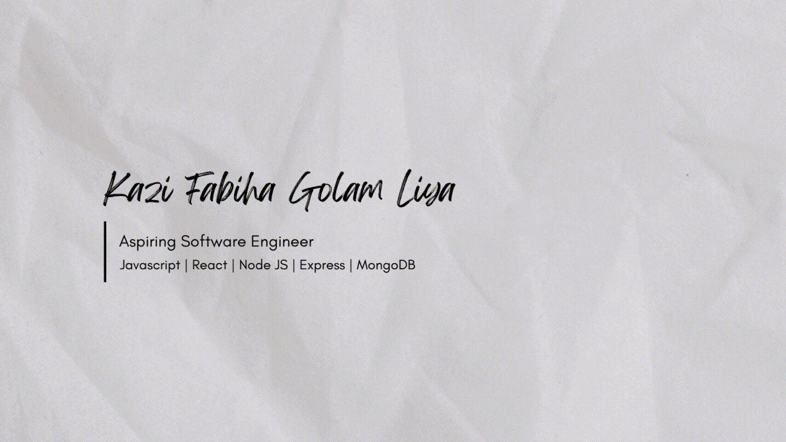

# Hey, This is Kazi Fabiha Liya! 

## About Me
I'm a final-year Computer Science & Engineering (CSE) student at Independent University, Bangladesh, with a passion for blending tech innovation with creative design. As an aspiring software engineer, I love building user-friendly full-stack apps using MERN stacks, while exploring AI and machine learning to solve real-world problems like empowering entrepreneurs or promoting eco-friendly initiatives. Currently, I'm gearing up for internships. Let's connect and create something amazing together! 🌱✨

## 🌱 Current Activities

- 🔭 I’m currently learning **Web Development & Video Editing**
- 🎨 Rebuilding my **Graphic Design Portfolio** (Canva + Illustrator)
- 🧠 Exploring the basics of **Machine Learning & AI**
- 💬 Improving my English speaking skills (C1-level **IELTS preparation**)
- 💼 Preparing for upcoming **internship opportunities**
- 🧪 Practicing Node JS & Express fundamentals through projects

  

## 🌟 Featured Projects
Here are some of my hands-on creations full-stack wonders. 

- **[StudyMate: Find Your Perfect Study Partner](https://studymate-auth-firebase.web.app/)**  
  A collaborative MERN app for students to connect based on subjects and experience. Features CRUD operations, search/sort filters, partner requests with counters, protected routes, dark/light mode toggle, and smooth Axios data fetching. Deployed on Firebase & Vercel.  
  *Tech: React, Node.js, Express, MongoDB, Tailwind CSS*
  
  

- **[WarmPaws: Winter Pet Care Booking Platform](https://warmpaws-suzipoo.netlify.app/)**  
  End-to-end booking system for pet services with Firebase auth, responsive UI, notifications, and fun animations. Scoped from user flows to deployment—perfect for cozy winter vibes!  
  *Tech: React, Tailwind CSS, Firebase, AOS, react-spring*
  
  

- **[Green Tree Plantation Website](https://green-earthz.netlify.app/)**  
  A responsive campaign site to inspire tree-planting and sustainability. Clean design with interactive elements to rally the community.  
  *Tech: HTML, JavaScript, Tailwind CSS, DaisyUI*
  
  

### 📝 Research Highlights
- **SproutSwap: Leveraging Web Technologies to Promote Urban Gardening and Eco-Entrepreneurship**  
  Published in IEEE QPAIN 2025 (First Author). A web platform fostering green communities—[Live Link](https://ieeexplore.ieee.org/document/11172090/).  
- **UddoktaAI: Empowering First-Time Entrepreneurs with Rule-Based & AI-Enhanced Business Advisory**  
  Accepted & presented at ICEBTM 2025 (First Author). 

## 🛠️ Tech Stack & Skills
I thrive on turning ideas into scalable, beautiful solutions. Here's what powers my projects:

| Category          | Tools & Frameworks                          |
|-------------------|---------------------------------------------|
| **Languages**     | Python, JavaScript                          |
| **Frontend**      | React, HTML, CSS, Tailwind CSS, DaisyUI     |
| **Backend**       | Node.js, Express                            |
| **Databases**     | MongoDB, Firebase                           |
| **Tools**         | Git, Netlify, Vercel, Axios, Jupyter Notebooks |
| **Design**        | Canva , Adobe Illustrator, AOS Animations |
| **Interests**     | Machine Learning, AI (Beginner) |

## 📚 Education
- **B.Sc. in Computer Science & Engineering**  
  *Independent University, Bangladesh (IUB), Dhaka*  
  Expected Graduation: April 2026 | GPA: 3.35/4.00  
  *Fueling my love for code and creativity one algorithm at a time. 💻*

## 🎓 Certifications (2025)
- AI+ Prompt Engineer Level 1™ (AI CERTS™)  
- Aspire Leaders Program (Aspire Institute/Harvard Faculty)  
- CCNA v7: Introduction to Networks (Cisco)  
- Professional Graphic Design (Creative IT Institute)  
- Graphic Design (eShikhon.com, BASIS Certified)  

## 🐱 Fun Facts About Me
Life's too short not to sprinkle in some joy here's a peek into my world:  
- Home to **7 fluffy cats** who rule my heart (and keyboard) 🐾  
- Obsessed with collecting **rare houseplants** my green oasis grows weekly! 🌿  
- Binge-watcher of **Korean survival & disaster movies** nothing beats that edge-of-your-seat thrill with a cozy blanket. 🍿  

## Let's Connect :handshake:

|
|--|--|

## 📊 GitHub Stats
  

---

*Thanks for stopping by your visit just made my day brighter! Have a nice day!*  

