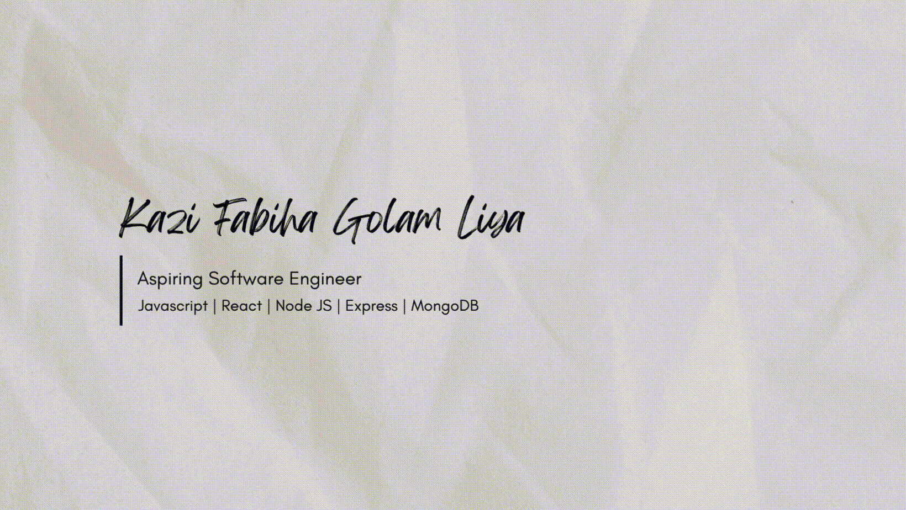
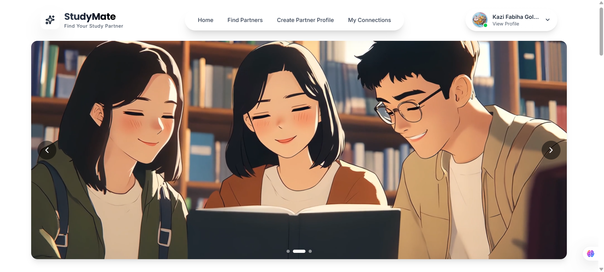
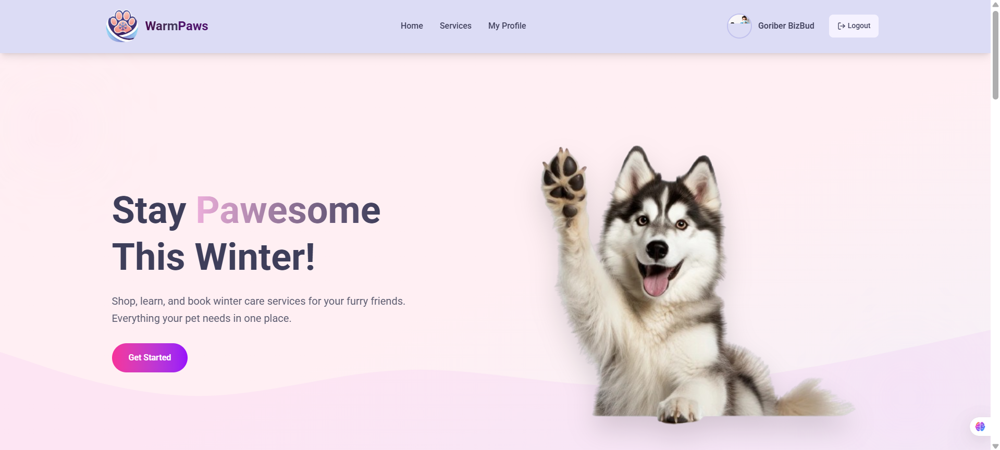

# Hey, I'm Kazi Fabiha Liya! 

  

  

---

## 👩‍💻 About Me

I'm a CSE graduate from **Independent University, Bangladesh**, currently interning at **BRAC's Technology Division**. I build full-stack web applications using the MERN stack, integrate AI/LLM pipelines into real products, and have published research at IEEE conferences as first author.

I enjoy turning complex problems into clean, deployable software — from enterprise access management systems to AI-powered advisory platforms.

- 🏢 Currently interning at **BRAC** (Technology Division, ERP Unit)
- 🔭 Building production-grade apps with **React, Node.js, MongoDB**
- 🤖 Integrating **LLMs, RAG pipelines, Cohere & Groq** into real projects
- 📄 **3 research papers** published/presented at IEEE conferences
- 🐱 Owned by **7 cats** and a growing houseplant collection 🌿

---

## 🚀 Featured Projects

### 🔐 [Sentinel: Employee Access & Role Management System](https://sentinel-earms.netlify.app/)
> Enterprise-grade ERP access governance platform built during my internship at BRAC.

Features role-based dashboards for employees, managers & admins, multi-level approval workflows with SLA tracking, delegation, escalation, JWT auth, audit logging, and a **RAG-based AI chatbot** using Cohere embeddings + MongoDB Atlas vector search + Groq LLM fallback.

`React` `Node.js` `Express` `MongoDB Atlas` `JWT` `Cohere` `Groq (LLaMA)` `RAG`

.png)
---

### 📚 [StudyMate: Find Your Perfect Study Partner](https://studymate-auth-firebase.web.app/)
> A collaborative MERN app for students to connect based on subjects and experience.

CRUD operations, search/sort filters, partner requests with counters, protected routes, dark/light mode, real-time UI updates. Deployed on Firebase & Vercel.

`React` `Node.js` `Express` `MongoDB` `Tailwind CSS` `Firebase`

---

### 🐾 [WarmPaws: Winter Pet Care Booking Platform](https://warmpaws-suzipoo.netlify.app/)
> End-to-end pet service booking with Firebase auth, responsive UI and smooth animations.

`React` `Tailwind CSS` `Firebase` `AOS` `react-spring`

---

## 📝 Research

| Year | Paper | Venue | Role |
|------|-------|-------|------|
| 2026 | Gamifying Cricket Coaching: An AI-Based Real-Time Training Platform for Young Players | ICEI 2026 | First Author |
| 2025 | [SproutSwap: Leveraging Web Technologies to Promote Urban Gardening and Eco-Entrepreneurship](https://ieeexplore.ieee.org/document/11172090/) | IEEE QPAIN 2025 | First Author |
| 2025 | Empowering First-Time Entrepreneurs with UddoktaAI: A Rule-Based and AI-Enhanced Business Advisory System | ICEBTM 2025 | First Author |

---

## 🛠️ Tech Stack

| Category | Tools |
|---|---|
| **Languages** | Python, JavaScript |
| **Frontend** | React, Next.js, HTML, CSS, Tailwind CSS |
| **Backend** | Node.js, Express |
| **Databases** | MongoDB, MongoDB Atlas Vector Search, Firebase |
| **AI & LLM** | RAG, Cohere Embeddings, Groq (LLaMA), PyTorch, YOLOv8 |
| **Auth & APIs** | JWT, REST APIs, Firebase Auth, Google OAuth |
| **Tools** | Git, Postman, Vercel, Netlify, Jupyter Notebooks |
| **Design** | Canva, Adobe Illustrator |

---

## 📊 GitHub Stats

  
  

  

  

  

  

---

## 🎓 Education & Certifications

**B.Sc. in Computer Science & Engineering**
Independent University, Bangladesh | Graduated July 2026 | CGPA: 3.37/4.00

**Certifications:**
- 🤖 AI & Machine Learning Fundamentals — Grameenphone Academy (2026)
- 💻 Web Development — Programming Hero (2026)
- 🧠 AI+ Prompt Engineer Level 1™ — AI CERTS™ (2025)
- 🎓 Aspire Leaders Program — Aspire Institute/Harvard Faculty (2025)
- 🌐 CCNA v7: Introduction to Networks — Cisco (2024)

---

## 🐱 Fun Facts

- Home to **7 fluffy cats** who rule my heart (and keyboard) 🐾
- Obsessed with collecting **rare houseplants** — my green oasis grows weekly 🌿
- Binge-watcher of **Korean survival & disaster movies** 🍿

---

## 🤝 Let's Connect

  
  &nbsp;&nbsp;
  
  &nbsp;&nbsp;
  

---

*Thanks for stopping by ^^ your visit just made my day brighter! Have a nice day! 🌟*
